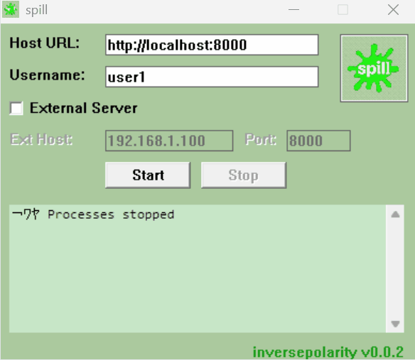

## spill v0.0.3a
### transient clipboard server for windows

### download latest version from [releases](https://github.com/inversepolarity/spill/releases/) and run

### features

- runs locally or provide an external host (http only, via ssh)
- https supported but needs certs installed on external host
- fully transient solution, no data is stored anywhere
- unicode supported
- ... more to come (image support, basic frontend for viewing clips etc.)

### prerequisites

- python should be installed on host

### how to build (gcc)

- clone the repo
- ensure python is installed
- install gcc, make etc.
- `make`
