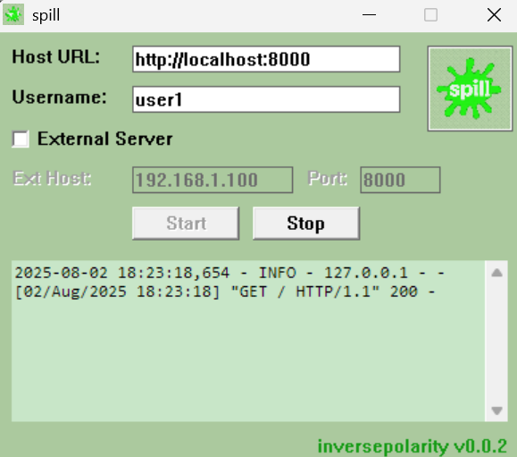

## spill v0.0.2
### transient clipboard server for windows




### prerequisites

- python should be installed on host

### how to use

- start the server until you see a log like this:

```
2025-08-02 16:41:21,221 - INFO - 127.0.0.1 - - [02/Aug/2025 16:41:21] "GET / HTTP/1.1" 200
```

- once we have this we are ready to roll, goto `<hostname|localhost>:<port|8000>` on your browser to see the details
- your clips are on `<hostname>/logs/<username>`

### how to build (gcc)

- clone the repo
- ensure python is installed
- install gcc, make etc.
- `make`